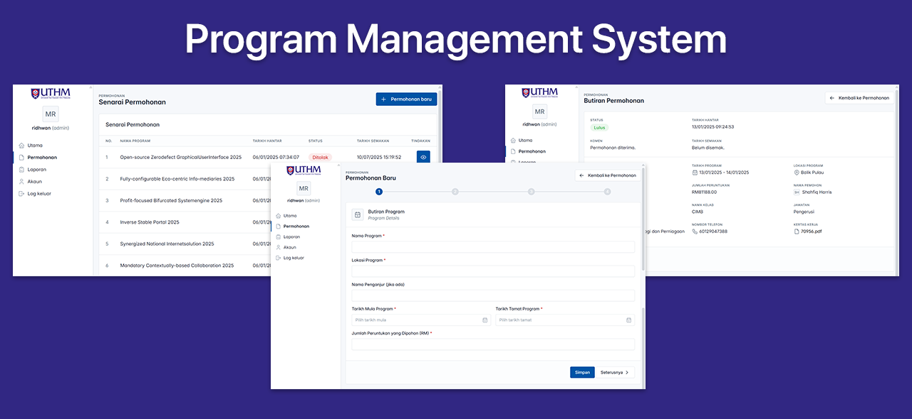

# Program Management System

An elegant and powerful web application designed to streamline program and application management. Built with CodeIgniter 4, this system provides a robust platform for administrators, users, and stakeholders to manage the entire application lifecycle, from submission to reporting.



## ✨ Features

This system is packed with features to make program management a breeze:

*   **👤 User Management:**
    *   Secure user authentication and registration.
    *   User-friendly dashboard for managing user accounts.
    *   Role-based access control to ensure users only see what they need to.

*   **📄 Application Management:**
    *   Intuitive interface for submitting new applications.
    *   Comprehensive view of all applications with their current status.
    *   Detailed view of each application with all its information.
    *   Ability to update and manage application data.

*   **📊 Reporting:**
    *   Generate insightful reports on application data.
    *   Export reports for further analysis and decision-making.

*   **🏛️ Faculty Management:**
    *   Manage faculty information within the system.

*   **🚀 Modern Tech Stack:**
    *   Built on the robust and speedy CodeIgniter 4 framework.
    *   Utilizes modern PHP 8.1 features.
    *   Interactive and responsive user interface.

## 🛠️ Tech Stack

*   **Framework:** CodeIgniter 4
*   **Backend:** PHP 8.1
*   **Frontend:** HTML, CSS, JavaScript
*   **Database:** MySQL (or other supported by CodeIgniter)
*   **Dependencies:**
    *   `codeigniter4/shield`: For authentication
    *   `enyo/dropzone`: For file uploads
    *   `irsyadulibad/codeigniter4-datatables`: For interactive tables

## 🚀 Getting Started

Follow these instructions to get the project up and running on your local machine.

### Prerequisites

*   PHP 8.1 or higher
*   Composer
*   A web server (like Apache or Nginx)
*   A database server (like MySQL)

### Installation

1.  **Clone the repository:**
    ```bash
    git clone https://github.com/your-username/program-management-system.git
    cd program-management-system
    ```

2.  **Install dependencies:**
    ```bash
    composer install
    ```

3.  **Configure your environment:**
    *   Rename `env` to `.env`.
    *   Edit the `.env` file and set the following:
        ```
        CI_ENVIRONMENT = development
        app.baseURL = 'http://localhost:8080' // or your preferred local URL
        database.default.hostname = localhost
        database.default.database = your_database_name
        database.default.username = your_database_username
        database.default.password = your_database_password
        database.default.DBDriver = MySQLi
        ```

4.  **Run database migrations:**
    ```bash
    php spark migrate
    ```

5.  **Seed the database (optional):**
    ```bash
    php spark db:seed PermohonanSeeder
    ```

### Running the Application

You can run the application using CodeIgniter's built-in server:

```bash
php spark serve
```

The application will be available at `http://localhost:8080`.

Alternatively, you can configure a virtual host on your web server to point to the `public` directory of the project.

## 📄 License

This project is licensed under the MIT License - see the [LICENSE](LICENSE) file for details.